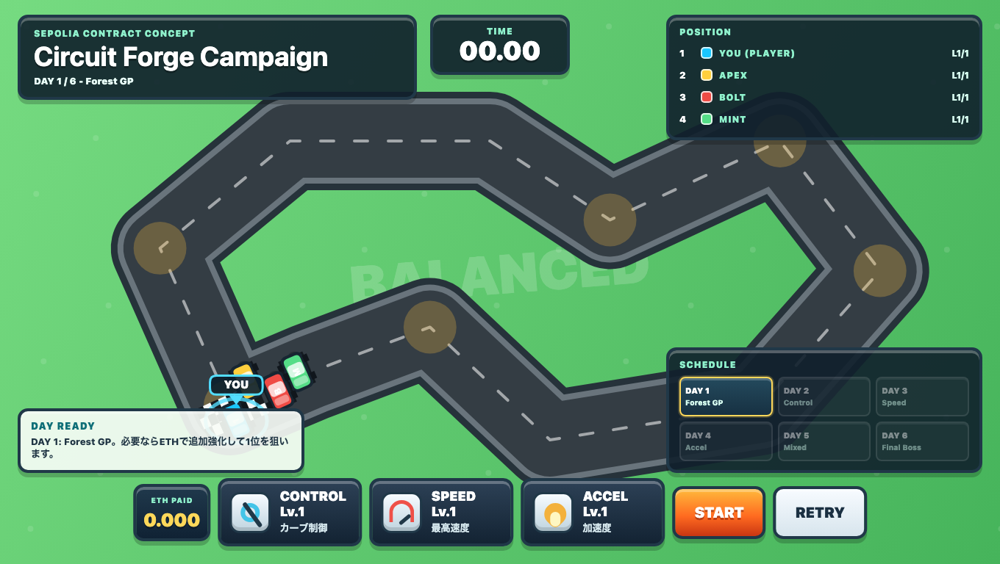
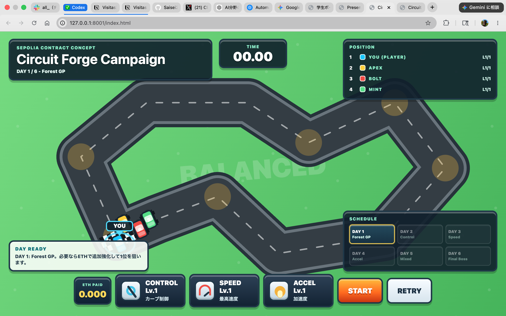
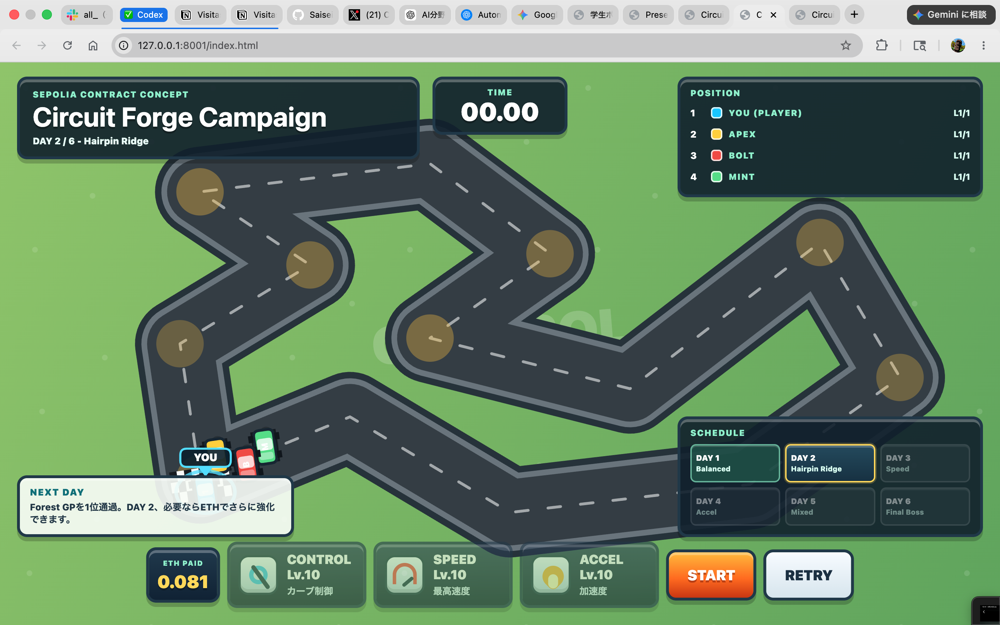
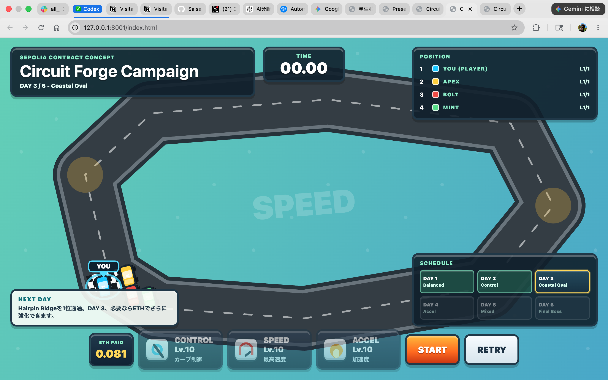
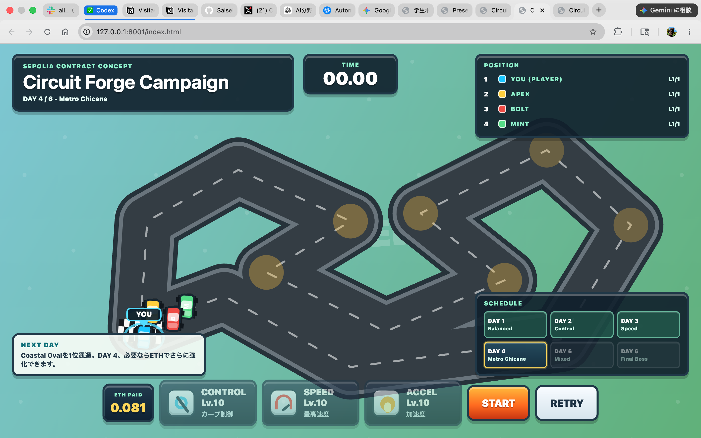
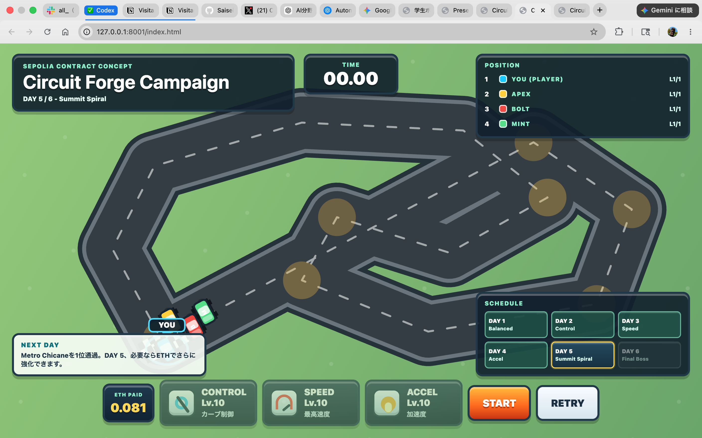
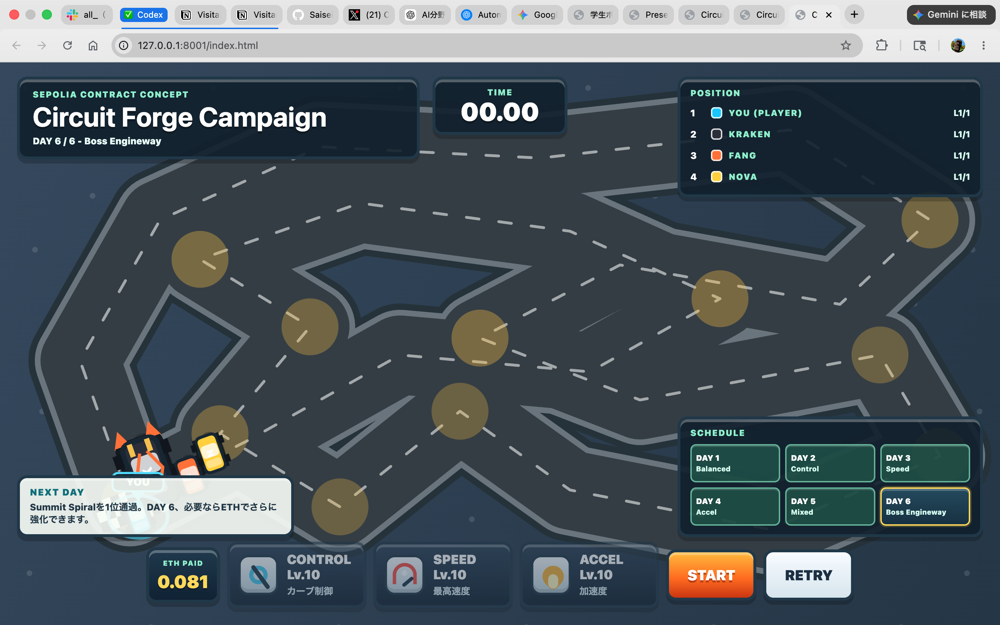

# Circuit Forge Campaign

Sepolia Testnet 上のスマートコントラクトと、ブラウザで動くレースゲームUIを組み合わせた課題制作です。  
テーマは「ETHを支払ってレーシングカーを強化し、6日間のレースキャンペーンを勝ち進むゲーム」です。



## 作品の概要

この作品では、プレイヤーの車に3つの能力があります。

| 能力 | 役割 | レースへの影響 |
|---|---|---|
| CONTROL | カーブ制御 | 速度が高い状態でも曲がりやすくなる |
| SPEED | 最高速度 | 直線区間で速く走れる |
| ACCEL | 加速度 | 減速後に早く立ち上がれる |

ゲーム画面ではこの3能力を強化しながら、DAY 1からDAY 6までのコースを攻略します。  
ブロックチェーン側では、車の作成・有料強化・イベント記録を Solidity のスマートコントラクトで実装しています。

## デプロイ情報

| 項目 | 内容 |
|---|---|
| Network | Sepolia Testnet |
| Contract | `0x56f1bcf9abad742ee34c36e338baa078a175693d` |
| Deploy Tx | `0x68d243345a7c64f4d4f28b304bb9ad13cc5cba97bdc35eafd3a536e44957a4fb` |
| Upgrade Fee | `0.003 ETH` |
| Max Level | `10` |

注意: この作品で使うETHは Sepolia のテストネットETHです。実際のお金として使うメインネットETHではありません。

## 起動方法

このリポジトリをクローンして、ローカルサーバーで開きます。

```bash
python3 -m http.server 8001
```

ブラウザで開きます。

```text
http://127.0.0.1:8001/index.html
```

MetaMaskと接続する場合は、ネットワークを Sepolia にしてください。

## UIの説明

| 場所 | 内容 |
|---|---|
| 左上 | タイトル、現在の日程、コース名 |
| 中央上 | レースタイム |
| 右上 | 現在順位 |
| 右下 | 6日間のコーススケジュール |
| 下部 | CONTROL / SPEED / ACCEL の強化ボタン |
| 下部中央 | START / RETRY ボタン |
| ON-CHAIN PANEL | MetaMask接続、車作成、Sepolia上での有料強化 |

ゲーム本体の強化ボタンは、発表や見た目確認用のローカルシミュレーションです。  
ON-CHAIN PANEL の `CREATE CAR` や `CONTROL +0.003 ETH` などのボタンは、MetaMaskを通して Sepolia のスマートコントラクトを実際に呼び出します。

## 6つのコース

### DAY 1: Forest GP



最初の基準コースです。カーブ、直線、立ち上がりがほどよく入っているので、3能力のバランスを確認できます。

### DAY 2: Hairpin Ridge



連続ヘアピンが多いコースです。速さだけを上げても曲がりきれないので、CONTROLの重要性が出るようにしています。

### DAY 3: Coastal Oval



長い直線が多い高速コースです。SPEEDを上げるとタイム短縮につながりますが、速度が高いほどカーブでは不利になります。

### DAY 4: Metro Chicane



細かい切り返しが続くコースです。減速と再加速が多いため、ACCELの効果が分かりやすいです。

### DAY 5: Summit Spiral



高速区間と複合コーナーが混ざった総合コースです。どれか1つだけ強化しても勝ちにくく、3能力のバランスが必要になります。

### DAY 6: Boss Engineway



最終日のラスボス戦です。敵車も強く、コースも長めにしてあります。全体的に高いレベルまで強化していることを想定しています。

## 課題要件との対応

| 課題要件 | この作品での実装 |
|---|---|
| 1. 外部からのみ呼び出せるfunction | `createCar`, `upgradeControl`, `upgradeSpeed`, `upgradeAccel`, `recordRaceResult` |
| 2. デプロイ者のみ実行できる機能 | `onlyDeployer` modifier と `getContractBalance()` |
| 3. ETHを支払う必要がある機能 | `upgradeControl`, `upgradeSpeed`, `upgradeAccel` が `payable` |
| 4. Eventを実装 | `RaceCarCreated`, `CarUpgraded`, `RaceResultRecorded` |
| 5. Sepoliaにデプロイ | Sepolia contract: `0x56f1...693d` |

## ブロックチェーン部分の考え方

普通のWebゲームでは、プレイヤーの強化データはブラウザやサーバーの中に保存されます。  
この作品では、車の作成や強化をスマートコントラクトに送ることで、「誰が」「どの車を」「何ETHで」「何を強化したか」をSepolia上に記録できます。

ブロックチェーンに載せる意味は、主に次の3つだと考えました。

| ポイント | 意味 |
|---|---|
| 改ざんしにくい | 一度記録されたトランザクションやイベントは、後からこっそり変えにくい |
| ウォレットで本人確認できる | `msg.sender` によって、操作したウォレットアドレスが分かる |
| 支払いと処理をセットにできる | `payable` により、ETHを払った時だけ強化する処理を書ける |

今回のゲームでは、実際のレース計算はブラウザ側で行い、課金・強化・記録の重要な部分だけをコントラクトに分けています。  
これは、全部をブロックチェーンに載せるとガス代が高くなりやすいためです。

## スマートコントラクトの主要コード

### 車のデータ構造

```solidity
struct RaceCar {
    string name;
    uint256 controlLevel;
    uint256 speedLevel;
    uint256 accelLevel;
    uint256 wins;
    uint256 races;
    uint256 totalPaid;
    address owner;
}
```

この部分では、1台の車に必要な情報をまとめています。  
`controlLevel`, `speedLevel`, `accelLevel` がゲームの3能力です。`owner` には、その車を作ったウォレットアドレスが入ります。

学べること:

- Solidityの `struct` で複数のデータをまとめる方法
- ウォレットアドレスを `address` 型で保存する方法
- ゲーム内データをオンチェーンの状態として管理する考え方

### デプロイ者だけが実行できるmodifier

```solidity
address public immutable deployer;

modifier onlyDeployer() {
    require(msg.sender == deployer, "Only deployer can call this function");
    _;
}

constructor() {
    deployer = msg.sender;
}

function getContractBalance() external view onlyDeployer returns (uint256) {
    return address(this).balance;
}
```

`constructor` はデプロイ時に一度だけ実行されます。  
ここで `deployer = msg.sender` とすることで、コントラクトをデプロイしたウォレットを保存しています。

`onlyDeployer` を付けた `getContractBalance()` は、デプロイ者だけがコントラクト残高を確認できます。

学べること:

- `modifier` を使って実行できる人を制限する方法
- `msg.sender` が「関数を呼び出したウォレット」を表すこと
- `address(this).balance` でコントラクトのETH残高を確認できること

### 無料で車を作るexternal function

```solidity
function createCar(string calldata name) external returns (uint256 carId) {
    carId = _createCar(msg.sender, name);
}
```

`external` は外部から呼び出す関数です。  
ここではユーザーが無料で車を作成できます。内部処理は `_createCar` に分けて、課題要件の部分が見やすくなるようにしています。

学べること:

- `external` function の書き方
- 外から呼ぶ関数と内部処理を分ける設計
- `calldata` を使って文字列を受け取る方法

### ETHを払って強化するpayable function

```solidity
uint256 public constant UPGRADE_FEE = 0.003 ether;

function upgradeControl(uint256 carId) external payable onlyCarOwner(carId) {
    _upgradeStat(carId, UpgradeStat.Control, msg.value);
}

function upgradeSpeed(uint256 carId) external payable onlyCarOwner(carId) {
    _upgradeStat(carId, UpgradeStat.Speed, msg.value);
}

function upgradeAccel(uint256 carId) external payable onlyCarOwner(carId) {
    _upgradeStat(carId, UpgradeStat.Accel, msg.value);
}
```

`payable` を付けると、その関数はETHを受け取れるようになります。  
この作品では、CONTROL / SPEED / ACCEL の強化にそれぞれ `0.003 ETH` が必要です。

学べること:

- `payable` function の使い方
- `msg.value` で送られたETH量を確認する方法
- `onlyCarOwner` で自分の車だけを強化できるようにする方法

### 強化処理の本体

```solidity
function _upgradeStat(uint256 carId, UpgradeStat stat, uint256 paid) private {
    require(paid == UPGRADE_FEE, "Upgrade costs exactly 0.003 ETH");

    RaceCar storage car = raceCars[carId];
    uint256 newLevel;

    if (stat == UpgradeStat.Control) {
        require(car.controlLevel < MAX_LEVEL, "Control is already max level");
        car.controlLevel += 1;
        newLevel = car.controlLevel;
    } else if (stat == UpgradeStat.Speed) {
        require(car.speedLevel < MAX_LEVEL, "Speed is already max level");
        car.speedLevel += 1;
        newLevel = car.speedLevel;
    } else {
        require(car.accelLevel < MAX_LEVEL, "Accel is already max level");
        car.accelLevel += 1;
        newLevel = car.accelLevel;
    }

    car.totalPaid += paid;
    emit CarUpgraded(msg.sender, carId, stat, newLevel, paid);
}
```

この関数が有料強化の中心です。  
`require(paid == UPGRADE_FEE)` により、ちょうど `0.003 ETH` を払った時だけ強化できます。

最後に `emit CarUpgraded(...)` を実行して、強化結果をイベントとして記録します。

学べること:

- `require` で条件を満たさない処理を止める方法
- `storage` を使ってブロックチェーン上のデータを書き換える方法
- `emit` でイベントログを残す方法

### イベントログ

```solidity
event CarUpgraded(
    address indexed user,
    uint256 indexed carId,
    UpgradeStat indexed stat,
    uint256 newLevel,
    uint256 paid
);
```

イベントは、トランザクションの結果を外部から確認しやすくするためのログです。  
`indexed` を付けると、Etherscanなどで検索しやすくなります。

この作品では、誰が、どの車を、どの能力で、何レベルに強化したかを記録しています。

## ブラウザとコントラクトの接続

`onchain.js` では、ethers.js を使ってブラウザからMetaMaskへ接続しています。

```js
const CONTRACT_ADDRESS = "0x56f1bcf9abad742ee34c36e338baa078a175693d";

async function connectWallet() {
  await ensureSepolia();
  provider = new ethers.BrowserProvider(window.ethereum);
  const accounts = await provider.send("eth_requestAccounts", []);
  account = accounts[0];
  signer = await provider.getSigner();
  contract = new ethers.Contract(CONTRACT_ADDRESS, ABI, signer);
}
```

ここで行っていることは、次の通りです。

| 処理 | 意味 |
|---|---|
| `window.ethereum` | MetaMaskがブラウザに用意する接続口 |
| `eth_requestAccounts` | ウォレット接続の許可を求める |
| `getSigner()` | トランザクションに署名する人を取得する |
| `new ethers.Contract(...)` | デプロイ済みコントラクトをJavaScriptから操作できる形にする |

強化ボタンを押したときは、次のようにコントラクトの `payable` function を呼びます。

```js
const tx = await raceForge[method](carId, { value: UPGRADE_FEE });
await tx.wait();
```

`value: UPGRADE_FEE` が、スマートコントラクトへ送るETHです。  
`await tx.wait()` は、トランザクションがブロックに取り込まれるまで待つ処理です。

## レースゲーム側のロジック

ゲーム側では、3つの能力がそれぞれ別の意味を持つようにしました。

```js
function carStats(car) {
  return {
    maxSpeed: 118 + car.speedLevel * 13,
    acceleration: 28 + car.accelLevel * 23,
    braking: 132 + car.control * 18,
    turnRate: 1.28 + car.control * 0.21,
    grip: 0.44 + car.control * 0.078
  };
}
```

`SPEED` は最高速度、`ACCEL` は加速、`CONTROL` はブレーキや旋回力に影響します。

また、単純に速度だけ上げれば勝てるゲームにならないように、カーブでは速度が高いほど曲がりにくくなるようにしています。

```js
const speedRatio = car.speed / Math.max(stats.maxSpeed, 1);
const speedGripLoss = speedRatio * speedRatio * (0.78 - car.control * 0.035);
const curveDemand = severity * 0.88 + steeringDemand * 0.24 + speedGripLoss;
const safeSpeed = stats.maxSpeed * clamp(1 - curveDemand + controlRelief - stopStartPenalty, 0.24, 0.98);
```

この部分により、直線は速い車が有利ですが、カーブでは減速やCONTROLが重要になります。  
つまり、課金して強化する能力にゲーム上の意味が出るようにしています。

## ファイル構成

```text
.
├── index.html
├── styles.css
├── game.js
├── onchain.js
├── contracts/
│   ├── RaceForgeCampaign.sol
│   └── RaceForgeHomeworkRequirements.sol
├── artifacts/
│   ├── RaceForgeCampaign.abi.json
│   ├── RaceForgeCampaign.bytecode.txt
│   └── artifact-build-manifest.json
├── assets/
│   ├── courses/
│   │   ├── day-1-forest-gp.png
│   │   ├── day-2-hairpin-ridge.png
│   │   ├── day-3-coastal-oval.png
│   │   ├── day-4-metro-chicane.png
│   │   ├── day-5-summit-spiral.png
│   │   └── day-6-boss-engineway.png
│   └── screenshots/
│       └── circuit_forge_game_ui.png
└── docs/
    ├── RaceForgeCampaign_student_presentation.pptx
    ├── Iot特論_BlockChain_4EP2_66_発表台本.md
    ├── RaceForgeCampaign_presentation_script.md
    └── final_submission_package.md
```

## 発表・提出用ファイル

| ファイル | 内容 |
|---|---|
| `docs/RaceForgeCampaign_student_presentation.pptx` | 学生っぽい発表資料 |
| `docs/Iot特論_BlockChain_4EP2_66_発表台本.md` | 発表用の読み上げ台本 |
| `docs/RaceForgeCampaign_presentation_script.md` | 追加の説明原稿 |
| `docs/final_submission_package.md` | 提出時に何を出すかの整理 |

## この制作で学べること

- Solidityで状態を保存する方法
- `external`, `private`, `view`, `payable` の違い
- `modifier` を使ったアクセス制御
- `event` と `indexed` によるログ記録
- MetaMaskとJavaScriptを使ってスマートコントラクトを呼ぶ方法
- ブロックチェーンに載せる部分と、ブラウザだけで動かす部分を分ける設計
- ゲームの能力値を、実際の操作感や勝敗に結びつける調整

## 注意点

- 秘密鍵やシードフレーズはこのリポジトリに含めていません。
- Sepolia ETHはテスト用です。
- `onchain.js` はブラウザから ethers.js CDN を読み込んでいます。
- 本格運用する場合は、フロントエンドのビルド環境やコントラクトの検証、エラー処理をさらに整える必要があります。

